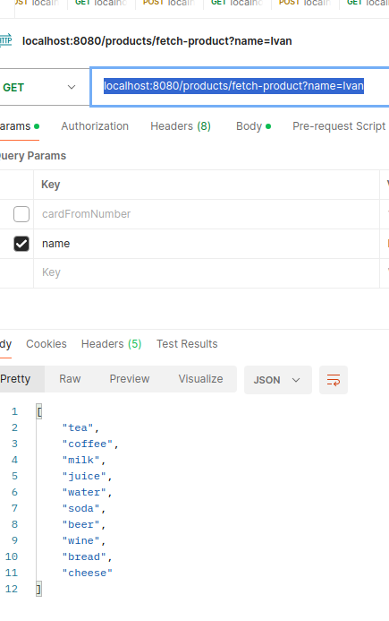

# Для локального тестировоания Hibernate

1) Установить все зависимости из `pom.xml`
2) Необходимо запустить `docker-compose up -d`
3) Запустить проект из Idea
4) Выполнить GET запрос
`GET localhost:8080/products/fetch-product?name=Ivan`

