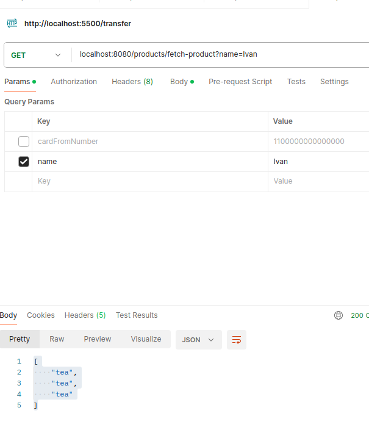

# Для локального тестировоания 

1) Установить все зависимости из `pom.xml`
2) Необходимо запустить `docker-compose up -d`
3) Запустить проект из Idea
4) положить все данные в таблицы
```sql
insert into customers(age, name, phone, surname)
values (12, 'Ivan', '89214445699', 'Testcustomers')

insert into orders(amount, customer_id, "date", product_name)
values (1000, 1, now(), 'tea')
```

Далее провести тестирование
